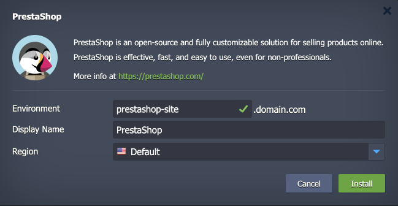

 

# PrestaShop

The package deploys the [PrestaShop](https://prestashop.com/) solution - an open-source, fully customizable e-commerce platform for selling products online. PrestaShop is effective, adapted to the growth of your business, fast and easy to use, even for non-professionals.

## Environment Topology

This package creates a dedicated PrestaShop environment that contains one application server and one database container. It automatically deploys and sets the PrestaShop application. The automatic vertical scaling is enabled out of the box, and [horizontal scaling](https://www.virtuozzo.com/application-platform-docs/automatic-horizontal-scaling/) can be configured (if needed). The default software stacks utilized in the package are the following:

- Apache 2 PHP application server (PHP 8.1)
- MySQL 8 database
- PrestaShop 8.1.7

## Deployment to Cloud

To get your PrestaShop solution, click the "**Deploy to Cloud**" button below, specify your email address within the widget, choose one of the [Virtuozzo Public Cloud Providers](https://www.virtuozzo.com/application-platform-partners/), and confirm by clicking **Install**.

> If you already have a Virtuozzo Application Platform (VAP) account, you can deploy this solution from the [Marketplace](https://www.virtuozzo.com/application-platform-docs/marketplace/) or [import](https://www.virtuozzo.com/application-platform-docs/environment-import/) a manifest file from this repository.

## Installation Process

In the opened installation window at the VAP dashboard, provide a preferred environment and display names, choose a region (if available), and confirm the installation.

Your PrestaShop application will be automatically installed in a few minutes.
